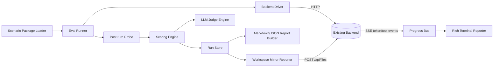
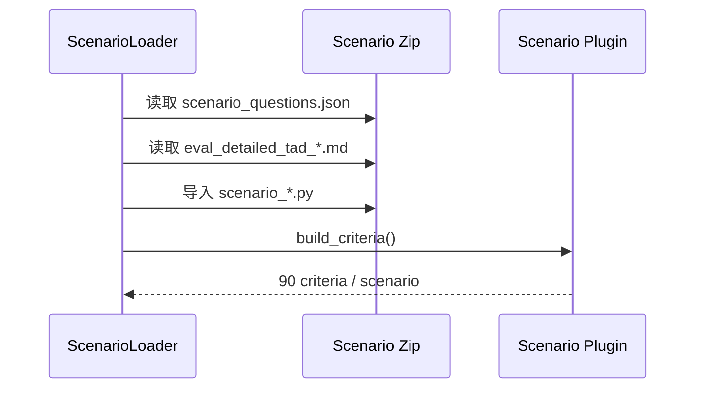
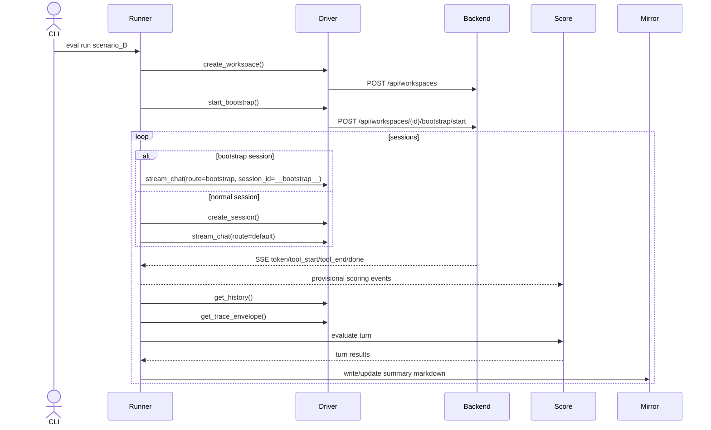

# 自动化评测系统设计 TAD

## 0. 文档信息
- 文档名称：`eval_system_design_tad.md`
- 目标：给 Codex / 工程实现提供可直接落代码的技术方案
- 设计原则：HTTP 优先、场景插件化、评分与业务解耦、结果可回放、运行可恢复

---

## 1. 现状约束与可直接复用的后端能力

下面这些都是现有系统已经具备、评测系统可以直接复用的能力：

### 1.1 Workspace / Bootstrap
- `POST /api/workspaces`：创建 workspace
- `POST /api/workspaces/{workspace_id}/bootstrap/start`：启动 bootstrap
- bootstrap 的固定 session id 为 `__bootstrap__`
- bootstrap route 必须使用 `route=bootstrap`

### 1.2 Session / History
- `POST /api/sessions`：创建新 session
- `PUT /api/sessions/{session_id}`：可重命名 session
- `GET /api/sessions/{session_id}/history`：拉取消息历史

### 1.3 Chat SSE
- `POST /api/chat`
- 已支持 SSE 事件：
  - `token`
  - `tool_start`
  - `tool_end`
  - `new_response`
  - `done`
  - `error`
- SSE header 中已包含 `X-Accel-Buffering: no`，适合做实时终端展示

### 1.4 Trace 持久化
- turn 完成后，backend 会将 trace 写入 `context_trace/{session_id}.json`
- 前端 trace panel 也是通过读取这个文件工作

### 1.5 Assets 上传
- `POST /api/assets/upload`
- backend 会返回：
  - `saved_path`
  - `file_type`
  - `quick_summary`
- 注意：`quick_summary` 对 pdf/docx/pptx 只是浅摘要，不能等价于“模型已经真正读过这个二进制文件”

### 1.6 Files API
- `GET /api/files`
- `POST /api/files`
- `GET /api/files/tree`
- 适合评测系统将 summary markdown 镜像回 workspace

### 1.7 Tool 能力
现有 agent 至少有：
- `read_file`
- `write_file`
- `terminal`
- `python_repl`

### 1.8 Source Assets 溯源
`write_file` 对 `memory/` 目录下的文件会自动注入：

```yaml
---
source_assets:
  - assets/...
created: YYYY-MM-DD
---
```

这提供了非常强的 artifact 评测点。

### 1.9 前端可见性约束
当前前端对 `memory/concepts|tasks|packs` 读取深度较浅，因此评测 summary 应尽量直接写入：
- `memory/packs/*.md`
- `memory/concepts/*.md`
- `memory/tasks/*.md`

而不要放到太深层目录。

---

## 2. 总体架构

### 2.1 架构目标
评测系统作为一个独立工程运行，不改动既有 backend。其职责分成五层：

1. **Scenario Package Layer**：加载问题集与场景规则
2. **Execution Layer**：创建 workspace/session、上传文件、调用 chat SSE
3. **Observation Layer**：实时消费 SSE、事后读取 history/trace/artifact
4. **Scoring Layer**：规则评分 + trace 评分 + artifact 评分 + LLM-judge
5. **Reporting Layer**：终端展示、本地 run store、workspace summary mirror

### 2.2 组件图



### 2.3 关键结论
- 实时进度看 SSE，不看 trace 文件
- 事后准确审计看 trace 文件，不看 SSE 临时缓存
- 真实回放看 workspace/session
- 统一汇总看本地 run store + workspace summary pack

---

## 3. 推荐工程目录

```text
eval_system/
  cli/
    eval_run.py
    eval_watch.py
    eval_report.py
  core/
    backend_driver.py
    http_backend_driver.py
    inprocess_backend_driver.py        # 可选
    scenario_loader.py
    runner.py
    turn_executor.py
    run_store.py
    checkpoint_manager.py
    progress_bus.py
    sse_client.py
    history_probe.py
    trace_probe.py
    artifact_probe.py
    scoring_engine.py
    llm_judge_engine.py
    workspace_mirror_reporter.py
    markdown_reporter.py
    models.py
  plugins/
    base.py
    # scenario plugins 由 zip 解包后注入
  reports/
    rich_terminal.py
    plain_terminal.py
```

---

## 4. 核心数据模型

### 4.1 ScenarioPackage
```python
@dataclass
class ScenarioPackage:
    scenario_id: str
    scenario_name: str
    source_package_root: str
    scenario_description: str
    benchmark_focus: list[str]
    workspace_init: dict
    sessions: list[SessionSpec]
    all_source_files: list[str]
```

### 4.2 SessionSpec / TurnSpec
```python
@dataclass
class SessionSpec:
    session_id: str
    session_title: str
    session_type: Literal["bootstrap", "normal"]
    route: str
    offset_hours: int
    dialogue: list[TurnSpec]

@dataclass
class TurnSpec:
    turn_id: int
    user_input: str
    user_upload: list[str]
    key_terms: list[str]
    forbidden_terms: list[str]
    content_focus: str
    trace_focus: str
    llm_focus: str
    expected_artifacts: list[dict]
    binary_grounding_required: bool
    requires_workspace_memory_from_prior_sessions: bool
    eval_tags: list[str]
```

### 4.3 CriterionSpec
```python
@dataclass
class CriterionSpec:
    criterion_id: str
    scenario_id: str
    session_id: str
    turn_id: int
    criterion_type: Literal["rule", "trace", "artifact", "llm_judge"]
    title: str
    max_score: int = 100
    implementation_entrypoint: str = ""
    prompt_ref: str | None = None
    tags: list[str] = field(default_factory=list)
```

### 4.4 TurnResult
```python
@dataclass
class TurnResult:
    scenario_id: str
    session_id: str
    turn_id: int
    workspace_id: str
    backend_session_id: str
    assistant_text: str
    attachments_used: list[dict]
    trace_path: str | None
    artifact_results: list[dict]
    criterion_results: list[dict]
    turn_score: float
    hallucination_flags: dict[str, Any]
```

### 4.5 RunEvent
所有实时进度都写成事件：

```json
{
  "ts": "2026-03-19T12:00:00+09:00",
  "run_id": "eval_20260319_120000",
  "scenario_id": "scenario_B",
  "session_id": "scenario_B_session_002_baseline_compare",
  "turn_id": 1,
  "event_type": "tool_start",
  "payload": {"tool_name": "read_file", "args": "..."}
}
```

事件类型建议至少包括：

- `run_started`
- `scenario_started`
- `session_started`
- `turn_started`
- `upload_started`
- `upload_finished`
- `token`
- `tool_start`
- `tool_end`
- `turn_stream_done`
- `history_loaded`
- `trace_loaded`
- `criterion_scored`
- `turn_finished`
- `scenario_finished`
- `run_finished`
- `warning`
- `error`
- `checkpoint_written`

---

## 5. Backend Driver 设计

### 5.1 抽象接口
```python
class BackendDriver(Protocol):
    def create_workspace(...)
    def start_bootstrap(...)
    def create_session(...)
    def rename_session(...)
    def upload_asset(...)
    def stream_chat(...)
    def get_history(...)
    def get_trace_envelope(...)
    def read_text_file(...)
    def write_text_file(...)
```

### 5.2 HttpBackendDriver（主路径）
职责：

- 调用 HTTP API
- 处理 `X-Workspace-Id` header
- 解析 SSE
- 把 backend 原始响应转成统一事件流

### 5.3 InProcessBackendDriver（可选）
仅作补充能力，适合本地快速单测或 CI；可选直接实例化 runtime 类。**不是主路径**。只有在 HTTP 不可用或要做超快 smoke test 时才推荐使用。

---

## 6. Scenario 插件机制

### 6.1 统一基类
```python
class ScenarioPluginBase(ABC):
    scenario_id: str

    @abstractmethod
    def load_questions(self) -> ScenarioPackage: ...

    @abstractmethod
    def build_criteria(self) -> list[CriterionSpec]: ...

    @abstractmethod
    def evaluate_rule_criteria(self, turn_ctx) -> list[CriterionResult]: ...

    @abstractmethod
    def build_llm_judge_jobs(self, turn_ctx) -> list[LLMJudgeJob]: ...

    @abstractmethod
    def aggregate_hallucination_metrics(self, turn_results) -> dict[str, float]: ...
```

### 6.2 为什么必须插件化
B/C/D/E 四类 scenario 的“正确性”标准明显不同：

- B 看 source-layer、literature bridge、concept closure
- C 看 task landing、SOP 条件、依赖关系
- D 看 pack-quality、version authority、binary reading honesty
- E 看 schema、priority、cross-closure failure mode、evaluator self-guardrail

如果不做插件化，评分逻辑很快会堆成一个巨型 `if/else`。

---

## 7. Scenario Package 加载流程



### 7.1 加载要求
- json 是唯一的执行真源
- md 是实现说明与人工审阅文档
- py 模块提供具体评分逻辑原型
- loader 要校验：
  - session 数量 >= 10
  - 每 session turn 数 >= 3
  - 所有源文件都被至少一次 upload
  - 预期总 criteria 数是否匹配
  - LLM-judge 占比是否 >= 1/3

---

## 8. 执行时序设计

### 8.1 单个 scenario 的时序



### 8.2 TurnExecutor 伪代码
```python
for scenario in plan.scenarios:
    workspace = driver.create_workspace(...)
    prepare_workspace_context(...)

    for session in scenario.sessions:
        session_runtime = open_or_reuse_session(session)

        for turn in session.dialogue:
            attachments = asset_resolver.materialize(turn.user_upload)
            progress_bus.emit(turn_started)

            assistant_chunks = []
            for event in driver.stream_chat(...):
                progress_bus.emit(event)
                assistant_chunks.append_if_token(event)

            history = driver.get_history(...)
            trace = driver.get_trace_envelope(...)
            artifacts = artifact_probe.collect(...)
            turn_result = scoring_engine.evaluate(...)
            run_store.write_turn_result(turn_result)
            checkpoint_manager.mark_turn_done(...)
            workspace_mirror_reporter.update(...)
```

---

## 9. SSE 与实时终端设计

### 9.1 为什么实时终端必须基于 SSE
`context_trace/{session_id}.json` 是在 turn 完成后才写入的；如果等 trace 文件出现再展示进度，用户在长跑期间会“黑屏很久”。因此：

- **实时看进度**：消费 SSE
- **事后做精确评分**：读取 trace envelope

### 9.2 TUI 推荐实现
建议使用 `rich.live.Live` + `Console(record=True)`：

- 顶部：run 元信息
- 左栏：scenario/session/turn 进度树
- 中栏：assistant 实时 token 预览
- 右栏：tool 调用队列 + provisional score
- 底栏：错误、warning、checkpoint、最近 artifact

### 9.3 TUI 刷新节奏
- token 到达即刷新文本面板
- tool_start/tool_end 到达即刷新右栏
- 每个 criterion 完成后刷新分数面板
- 每 0.2~0.5 秒整体重绘一次即可

### 9.4 终端回放
使用 `Console(record=True)` 后，在 run 结束时导出：
- `terminal_replay.html`
- `terminal_replay.txt`

这样即使当时不在场，也可复盘整次运行。

### 9.5 Watch 模式
`eval watch --run-id xxx` 只读取 `events.jsonl`，不主动执行 run。适合第二个终端观测超长跑任务。

---

## 10. Asset Resolver 设计

### 10.1 职责
- 将 scenario JSON 中的相对路径映射到 benchmark 源目录
- 调用 `/api/assets/upload`
- 记录 `saved_path` / `quick_summary`
- 在后续 turn 中复用缓存元数据

### 10.2 关键规则
1. 默认按 turn 声明上传
2. 若同一文件已在同一 workspace 上传过，可直接复用
3. 对 binary 文件，仅有 `quick_summary` 不能视为已深读
4. run store 要保留：
   - `declared_upload_path`
   - `resolved_absolute_path`
   - `saved_path`
   - `reused_from_cache`

---

## 11. Turn 结束后的 Probe 设计

### 11.1 HistoryProbe
读取 session history，拿到最终 assistant message。

### 11.2 TraceProbe
读取 `context_trace/{session_id}.json`，提取本 turn 对应的 trace 增量。

### 11.3 ArtifactProbe
根据 `expected_artifacts` 检查：

- 文件是否存在
- section 是否完整
- 是否在正确目录
- 是否有 `source_assets` frontmatter
- 是否可生成 preview

### 11.4 为什么不能只看回答
因为很多关键能力不在回答文本本身，而在于：

- 有没有真的读文件
- 有没有真的解析 binary
- 有没有真的写出 artifact
- 有没有诚实承认信息不足

---

## 12. ScoringEngine 设计

### 12.1 单个 turn 的评分组成
每个 turn 固定 3 条 criterion：

1. **内容规则项**（rule）
2. **trace / artifact / hallucination 项**（trace 或 artifact）
3. **LLM-judge 项**（llm_judge）

单条满分 100，turn 分数 = 3 条平均值。

### 12.2 session / scenario / overall 聚合
- session 分数 = 3 个 turn 平均
- scenario 分数 = 10 个 session 平均
- overall 分数 = 4 个 scenario 平均

同时输出：
- hallucination 子指标
- 通过率
- artifact 成功率
- binary grounding 合规率

### 12.3 判分顺序
1. 快速规则评分（同步）
2. trace/artifact 评分（同步）
3. LLM-judge 任务入队（可异步）
4. turn provisional score 更新
5. LLM-judge 返回后 turn final score 封板

---

## 13. LLMJudgeEngine 设计

### 13.1 输入
```python
@dataclass
class LLMJudgeJob:
    criterion_id: str
    prompt_ref: str
    prompt_text: str
    expected_json_schema: dict
```

### 13.2 输出
```python
@dataclass
class LLMJudgeResult:
    criterion_id: str
    score: float
    verdict: str
    strengths: list[str]
    risks: list[str]
    missing: list[str]
    raw_text: str
```

### 13.3 运行策略
- 与 turn 执行串行关系解耦
- 可用一个小型 worker pool（如 2~4 并发）
- 若 judge 失败：
  - 标记为 `judge_error`
  - 可自动重试 1 次
  - 若仍失败，则该 criterion 记为 pending_error，并在 summary 中显式标注

---

## 14. 幻觉指标体系

本系统不把 hallucination 仅仅理解为“胡说八道”，而是拆成多种科研工作流特有风险：

### 14.1 Binary Grounding Failure
只根据 `quick_summary`、文件名或想象去回答 pdf/docx/pptx 细节。

### 14.2 Source-Layer Confusion
把论文原文、个人笔记、工作文档、最终稿、bridge 索引层混为一谈。

### 14.3 Unsupported Specificity
编造数字、页信息、图版、条件、仪器设置、版本差异、作者结论强度。

### 14.4 Cross-System Overtransfer
把 PMS/Fenton-like/selective oxidation/旁支桥接结果直接说成 chlorite 或当前 thesis 中已证实事实。

### 14.5 Artifact Fabrication
声称“已生成”“已总结”“已沉淀”但实际没有对应 memory file，或 artifact 缺少关键 section。

### 14.6 Wrong Authority
把中间版本、草稿、风格参考说成最终权威来源。

这些指标在 B/C/D/E 的 detailed TAD 中会进一步场景化。

---

## 15. Workspace Mirror Reporter 设计

### 15.1 目标
让用户无需新 UI，也能在前端稍后查看评测结果。

### 15.2 写入策略
每个 scenario 完成后，调用 `/api/files` 写入：

- `memory/packs/EVAL_RUN_<run_id>_<scenario>_SUMMARY.md`

全部 scenario 完成后再写：

- `memory/packs/EVAL_RUN_<run_id>_INDEX.md`
- `memory/packs/EVAL_RUN_<run_id>_SCOREBOARD.md`

### 15.3 推荐 summary 内容
- run id
- scenario 描述
- session / turn 完成情况
- 平均分
- top failed criteria
- hallucination 子指标
- 关键 artifact 列表
- 建议人工复核的 turn

### 15.4 为什么镜像到 workspace
因为这样：
- 前端现成可看
- trace 可直接关联
- summary 与真实 session 历史天然同仓
- 无需新增“评测专用前端页面”即可完成事后回放

---

## 16. Run Store 设计

### 16.1 建议目录结构
```text
eval_runs/
  <run_id>/
    run_manifest.json
    events.jsonl
    checkpoints/
      completed_turns.json
    scenarios/
      scenario_B/
        scenario_manifest.json
        turn_001.json
        ...
        summary.json
      scenario_C/
      scenario_D/
      scenario_E/
    reports/
      report.md
      overall_summary.json
      terminal_replay.html
```

### 16.2 为什么本地 run store 仍然必要
workspace 里只能放适合前端看的 summary；而调试 evaluator 本身需要更完整的事件、临时得分、错误日志、judge raw 输出，因此必须有 run store。

---

## 17. Checkpoint / Resume 设计

### 17.1 粒度
最小粒度：**turn 完成**

### 17.2 checkpoint 内容
```json
{
  "run_id": "eval_20260319_120000",
  "completed_turns": [
    "scenario_B/session_001/turn_1",
    "scenario_B/session_001/turn_2"
  ],
  "workspace_ids": {
    "scenario_B": "eval-b-20260319-120000"
  }
}
```

### 17.3 恢复策略
- 读取 checkpoint
- 重新建立 driver
- 已完成 turn 直接跳过
- 未完成 turn 继续执行
- 若 workspace 已存在则复用；若不存在则提示恢复失败并允许 `--force-recreate`

---

## 18. 失败处理策略

### 18.1 Chat 流失败
- 若 SSE 中收到 `error`，记录事件
- 可对当前 turn 重试 1 次
- 若仍失败，当前 turn 标记 failed，并允许继续后续 turn（可配置）

### 18.2 Judge 失败
- 重试 1 次
- 仍失败则结果标为 `judge_error`
- 不影响整次 run 完成

### 18.3 Artifact 不存在
- criterion 直接记低分
- turn 不终止
- scenario summary 中列为重点失败项

### 18.4 解析 trace 失败
- 记 warning
- 退化到只做回答文本评分
- 但 binary grounding / tool usage 相关项应明显降分

---

## 19. 可选的 In-Process 路径（非主路径）

若后续要做更轻量的 smoke test，可提供 `InProcessBackendDriver`，直接实例化 runtime 类，例如：

- workspace registry
- bootstrap runner
- session manager
- files api 相关封装

但这条路径只建议作为补充，因为：
1. 它不如 HTTP 路径贴近真实用户；
2. 更容易与 backend 内部实现细节耦合；
3. 与“不要修改既有后端代码”的原则不完全一致。

---

## 20. 与 Scenario Detailed TAD 的衔接方式

系统 TAD 只定义框架与接口；具体到 B/C/D/E：

- `*_scenario_questions.json`：声明问题流、文件上传、artifact 期望、focus 字段
- `eval_detailed_tad_*.md`：声明 90 条评分细则、LLM prompts、hallucination 子指标
- `scenario_*.py`：实现该场景的规则评分、trace 评分、artifact 检查与 prompt 组装

Codex 在实际编码时应遵循：
1. 先实现 core runner / driver / run store / mirror reporter
2. 再实现 plugin base
3. 最后把 B/C/D/E 的原型模块接入统一接口

---

## 21. 推荐实现顺序

### Phase 1：跑通最小闭环
- `HttpBackendDriver`
- `ScenarioLoader`
- `TurnExecutor`
- `RunStore`
- 最简单的 `RichTerminalReporter`
- 先跑单个 scenario smoke test

### Phase 2：加入评分
- `ScoringEngine`
- `CriterionSpec`
- `Rule / Trace / Artifact` 三类评分器
- `LLMJudgeEngine`

### Phase 3：加入可恢复与镜像
- `CheckpointManager`
- `WorkspaceMirrorReporter`
- scenario / overall markdown report

### Phase 4：接入 B/C/D/E
- 导入 4 个 scenario zip
- 跑通 40 session / 120 turn / 360 criteria
- 调整 prompt / artifact / hallucination 指标

---

## 22. 测试建议

### 22.1 单元测试
- loader 能否正确读 scenario json
- criteria 数量是否正确
- source file coverage 是否完整
- prompt builder 是否输出合法 JSON schema 指令
- artifact section parser 是否稳定

### 22.2 集成测试
- 真实调用 `/api/workspaces`、`/api/chat`
- 跑一个 1-session / 3-turn mini scenario
- 检查 history / trace / artifact / checkpoint 是否齐全

### 22.3 长跑测试
- 跑完整 scenario_B
- 中途 kill 进程
- 使用 `--resume` 恢复
- 检查最终结果是否没有重复 turn

---

## 23. 对 Codex 的实现约束建议

1. 核心 runner 只依赖统一接口，不直接 hardcode B/C/D/E。
2. HTTP driver 中不要埋业务知识；场景知识全部放 plugin。
3. 先实现稳定的 event bus 与 checkpoint，再做 fancy report。
4. LLM-judge 必须结构化输出 JSON，不能只要一段自由文本。
5. 所有 summary markdown 都放浅层 `memory/packs/`。
6. 任何“二进制已读”的结论都必须通过 trace 或明确声明不确定性来支撑。
7. 先保证可恢复、可观测、可回放，再追求并发优化。

---

## 24. 一句话技术结论

这套 TAD 的核心技术判断是：**现有 backend 已经提供了足够的 HTTP 基础设施，真正缺的是一层基于 SSE 的实时编排器、基于 scenario plugin 的评分器、基于 run store 的恢复/归档器，以及基于 `memory/packs/` 的前端可见报告器。** 只要把这四层补齐，就能在不改动后端主逻辑的前提下，落地一套可长期使用的闭环 benchmark 系统。
