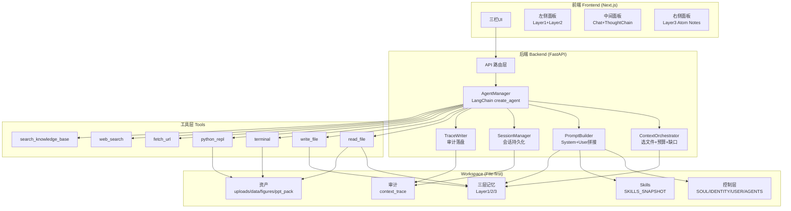
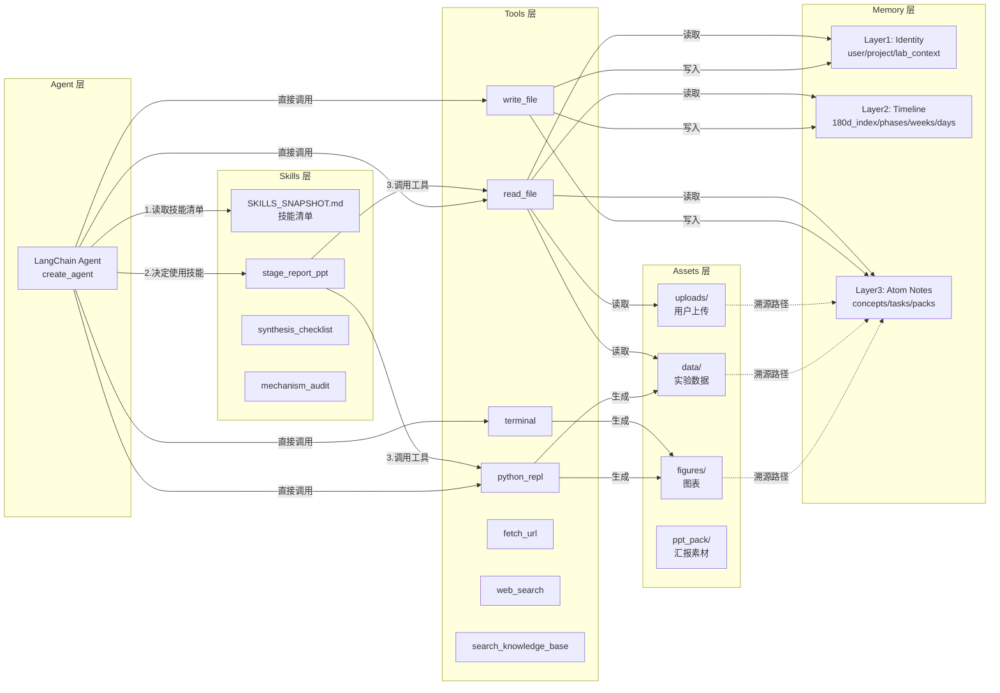
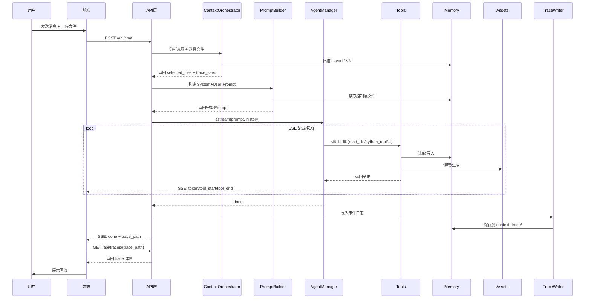
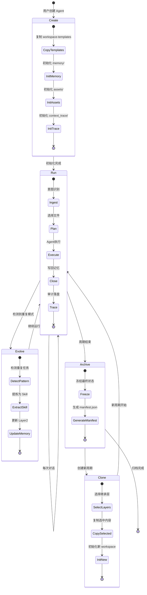
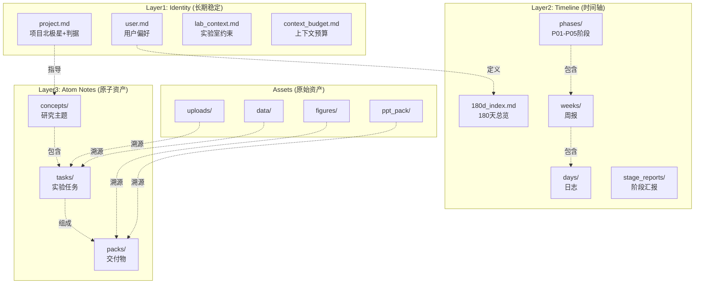
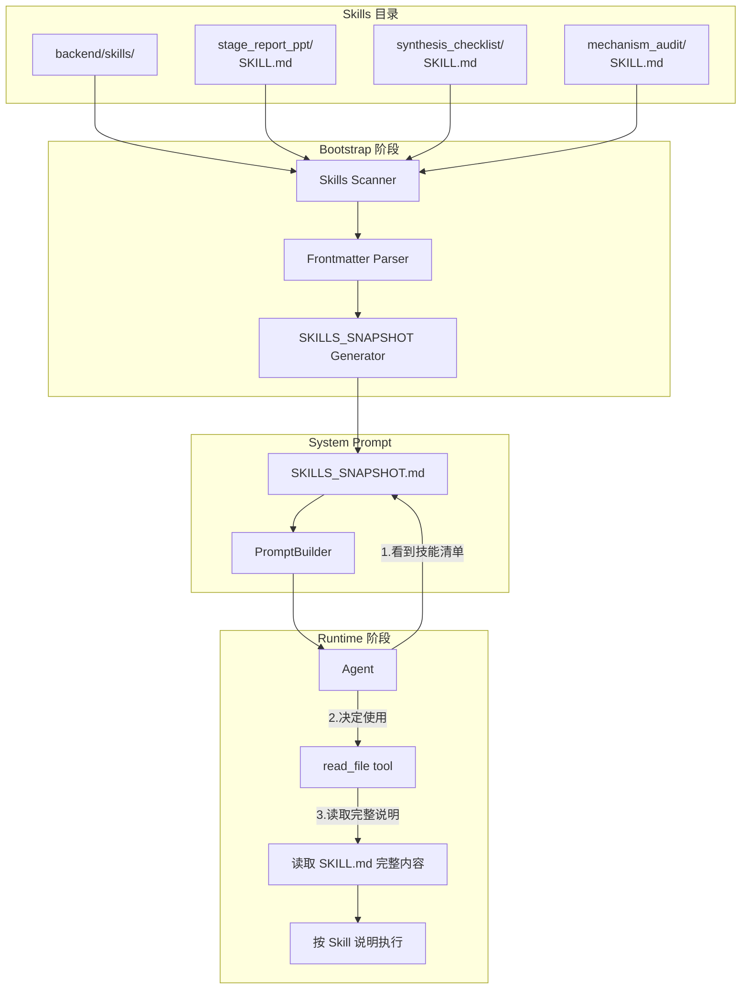
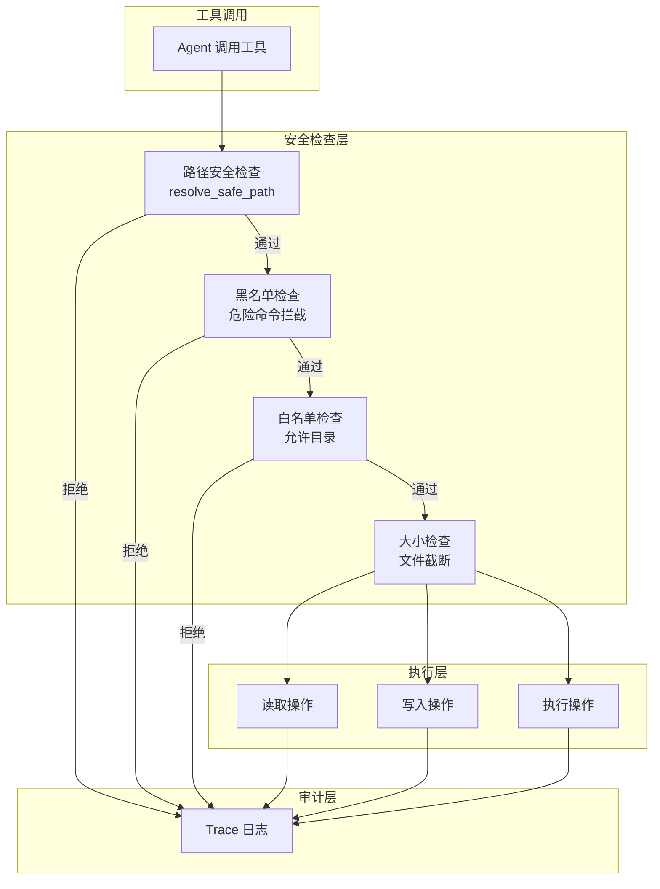

# Experimental-Research-OpenClaw 架构图集

**版本**: v1.0 | **日期**: 2026-03-09

---

## 一、系统总体架构

### 1.1 前后端 + 记忆系统 + Workspace 架构



**说明**:
- **前端**: 三栏 IDE 风格,支持拖拽分隔条
- **后端**: FastAPI + LangChain create_agent,SSE 流式推送
- **工具层**: 7个核心工具,支持文件操作、代码执行、网络访问
- **Workspace**: File-first 设计,所有数据以文件形式存储

---

## 二、Agent-Skills-Tools-Memory&Assets 关系架构

### 2.1 核心关系图



**关键流程**:
1. Agent 读取 SKILLS_SNAPSHOT,了解可用技能
2. Agent 根据任务决定使用哪个 Skill
3. Skill 通过调用 Tools 完成任务
4. Tools 操作 Memory 和 Assets
5. Memory 中记录 Assets 的溯源路径

---

## 三、单次对话的完整流程

### 3.1 用户消息处理流程



**关键步骤**:
1. **意图识别**: ContextOrchestrator 分析用户意图,选择相关文件
2. **Prompt 构建**: PromptBuilder 拼接 System+User 消息
3. **Agent 执行**: 流式调用工具,生成响应
4. **审计落盘**: TraceWriter 记录所有操作
5. **回放展示**: 前端展示完整的执行过程

---

## 四、Workspace 生命周期

### 4.1 完整生命周期



**生命周期说明**:
1. **Create**: 从模板创建新 workspace
2. **Run**: 日常对话循环
3. **Evolve**: 自动提炼 Skills 和更新记忆
4. **Archive**: 周期结束,冻结状态
5. **Clone**: 创建新周期,选择性继承

---

## 五、Memory 三层架构详解

### 5.1 三层记忆结构



**层级关系**:
- **Layer1**: 定义"你是谁、项目是什么"
- **Layer2**: 记录"时间推进、阶段进展"
- **Layer3**: 存储"原子证据、可复用对象"
- **Assets**: 保存"原始文件、生成产物"

---

## 六、Assets 与 Memory 的溯源关系

### 6.1 溯源流程

```mermaid
graph LR
    subgraph "用户操作"
        Upload[用户上传文件]
    end

    subgraph "Assets 存储"
        SaveAssets[保存到 assets/uploads/]
        GetPath[获取文件路径]
    end

    subgraph "LLM 处理"
        ReadAssets[LLM 读取 assets]
        ProcessData[处理数据/分析]
        GenerateMemory[生成 memory 内容]
    end

    subgraph "Memory 写入"
        WriteMemory[写入 memory/tasks/ 或 memory/packs/]
        EmbedPath[嵌入 assets 路径]
    end

    subgraph "用户溯源"
        ViewMemory[查看 memory 文件]
        ClickPath[点击 assets 路径]
        ViewOriginal[查看原始文件]
    end

    Upload --> SaveAssets
    SaveAssets --> GetPath
    GetPath --> ReadAssets
    ReadAssets --> ProcessData
    ProcessData --> GenerateMemory
    GenerateMemory --> WriteMemory
    WriteMemory --> EmbedPath

    EmbedPath --> ViewMemory
    ViewMemory --> ClickPath
    ClickPath --> ViewOriginal
```



**溯源示例**:

```markdown
## TASK_exp_005.md

### 实验数据

**原始数据**: [XRD数据](assets/data/exp_005_xrd.csv)
**谱图**: [XRD谱图](assets/figures/exp_005_xrd.png)
**实验照片**: [样品照片](assets/uploads/20250901_sample.jpg)

### 分析结果

根据 XRD 数据分析,Co(IV) 特征峰在 2θ=31.2°...
```

**关键设计**:
1. ✅ Memory 文件中嵌入 assets 相对路径
2. ✅ 前端支持点击路径跳转
3. ✅ 支持多模态溯源 (CSV/图片/PDF)

---

## 七、Phase 5: Skills 加载系统

### 7.1 Skills 系统架构



**Skills 加载流程**:
1. **Bootstrap**: 扫描 skills/ 目录,生成 SKILLS_SNAPSHOT.md
2. **注入**: PromptBuilder 将 SKILLS_SNAPSHOT 注入 System Prompt
3. **执行**: Agent 通过 read_file 读取完整 SKILL.md,按说明执行

**SKILL.md 格式**:

```markdown
---
name: stage_report_ppt
description: 生成阶段汇报 PPT 的页级结构
version: 1.0
---

# Stage Report PPT Skill

## 使用场景
当用户请求"准备第N次阶段汇报"时使用

## 输入要求
- assets/ppt_pack/Rxx_YYYYMMDD/ 素材路径
- 时间范围 (如"最近两周")

## 执行步骤
1. 使用 read_file 读取 memory/timeline/stage_reports/上一期.md
2. 使用 read_file 读取 memory/timeline/weeks/ 相关周报
3. 使用 python_repl 分析素材文件
4. 生成 PPT 结构 (页级 + 中心句)
5. 使用 write_file 写入 memory/packs/PACK_stage_report_Rxx.md

## 输出格式
...
```

---

## 八、工具安全架构

### 8.1 工具安全检查



**安全措施**:
1. **路径检查**: 防止路径遍历攻击
2. **黑名单**: 拦截危险命令 (rm -rf /, dd, mkfs 等)
3. **白名单**: 限制操作目录 (workspace/, memory/, assets/)
4. **大小限制**: 自动截断超大文件 (20000 字符)
5. **审计日志**: 记录所有工具调用

---

## 九、总结

### 9.1 架构关键点

1. **File-first**: 所有数据以文件形式存储,透明可审计
2. **Tool-Driven**: LLM 通过工具主动访问 memory 和 assets
3. **三层记忆**: Layer1(稳定) + Layer2(时间轴) + Layer3(原子资产)
4. **溯源机制**: Memory 嵌入 assets 路径,支持回溯
5. **Skills 系统**: Instruction-following 范式,拖入即用
6. **安全设计**: 多层安全检查,完整审计日志

### 9.2 架构优势

- ✅ **透明**: 所有数据可读可审计
- ✅ **灵活**: 按需读取,降低 token 消耗
- ✅ **可扩展**: 易于添加新工具和 Skills
- ✅ **可溯源**: 完整的 assets → memory 溯源链
- ✅ **安全**: 多层安全检查,防止误操作

---

**文档完成** | 2026-03-09
