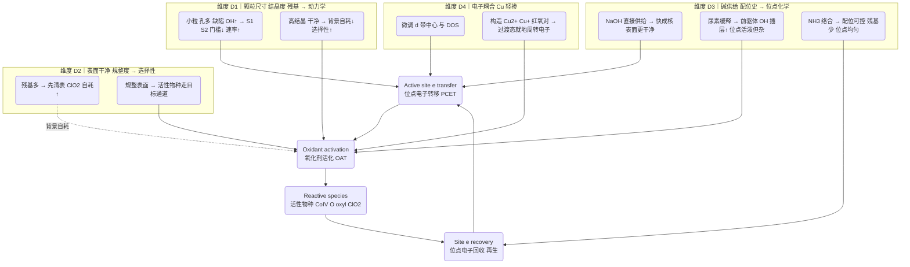

照着做那就简单多了。
#日志20250911
# 实验细节索引
- 材料合成
[[【第二阶段】材料合成方法汇总]]
- 表征测试方法
[[【亚氯酸盐AOPs】]]

#日志20250926 
想要不带脑子的关键：==所有【标号】都不能掉==，否则有搞混or样品交叉污染的风险。
[[【第二阶段v1】20250925材料制备]]

# 20250919：二价和三价金属效果并不明显
![[c83e21edb37ec8c9b446cc443e587390.png]]

后续解决问题的思路——新建一个目的脉络
[[0-【掺杂配位&缺陷工程&晶面工程】：金属配位]]

#日志20250919 
师兄说效果好，考虑降低实验浓度，0.1mM到0.5mM逐步增加0.1mM（母液NaClO2的量减半）。
![[b3f06cf1277befa2d7e065964d3fcc7f.png]]

![[a74a559f65ec7ad79e46a1d704b1df93.png]]

实验结果：
浓度减半之后基本吻合，基本确定了性能好的材料是Co3O4。

与[[2024-PNAS-UV-induced-OV-Co3O4- OV-induced low coordinated Co& anchor Cl to produce 三Co(IV)=O👉ClO2]]的SI[[【SI】2024-PNAS-UV-induced-OV-Co3O4- OV-induced low coordinated Co& anchor Cl to produce 三Co(IV)=O👉ClO2.pdf]]进行对比，并比较反应动力学常数
![[Pasted image 20250922203454.png]]

【拟合智能体】：[使用GraphPad模拟反应速率常数步骤 - Kimi](https://www.kimi.com/chat/d38jq2u4bbjn3l33aopg)
【制图sop】：[[【Graphpad】性能体系：性能+动力学]]

[[0-【掺杂配位&缺陷工程&晶面工程】：金属配位]]
[[【SI】2024-PNAS-UV-induced-OV-Co3O4- OV-induced low coordinated Co& anchor Cl to produce 三Co(IV)=O👉ClO2.pdf]]
[[

# 关键机理推断：高价Co有没有形成？ClO2有没有形成？
>如果形成了的话，就可以往新范式推动。
## 为什么一定要生成[【元素：高价金属物种】](https://chatgpt.com/g/g-p-68d536a5d2508191b87182af5929a762/c/68de684e-2428-8332-abe9-3515cceedc22)

稳定性高-可控性强
主要吉利是OAT

| 维度   | 高价金属氧化物（M–O* / O_latt*） | 自由基（•OH / SO₄•⁻） |
| ---- | ----------------------- | ---------------- |
| 反应路径 | 内配位/两电子/氧原子转移为主         | 外配位/单电子/氢抽提为主    |
| 选择性  | 高、可定向                   | 低、非选择性强          |
| 基质耐受 | 强（不易被 HCO₃⁻/Cl⁻ 清除）     | 弱（易被清除）          |
| 副产物  | 卤代/碎化更少                 | 卤代与过度矿化风险高       |
| 设计空间 | 大（价态、配位、O_v 可调）         | 中（主要靠自由基剂与条件）    |
| 放大实现 | 易负载、可电极化                | 需控制自由基逃逸与安全      |

# 20251013
#日志20251013

## 实验结果
![[Pasted image 20251013144926.png]]

1012+1013重复合成的实验效果出现了问题：
- 1012+1013同批性能相比：Co3O4＞Cu-Co3O4＞Co3O4-NH3
	- Cu掺杂的实验结果与之前不符：Co3O4＞Cu-Co3O4。
	- 氨水和纯水制备的Co3O4相较于Co3O4和Cu-Co3O4性能较差，但差异不明显。
		- 纳米片形貌对于Co3O4性能的影响是否没有想象中的那么大？
- 
![[Pasted image 20251013144621.png]]

0922+1012/1014不同批次合成材料性能对比：
	- Co3O4相较于原来变好了
	- Cu-Co3O4相较于原来变差得很明显。

![[Pasted image 20251013145031.png]]
对0922和1011两批制样数据（每批制样两次平行实验）进行汇总，结果如下：

## 实验结果复盘（AI 问题树）

- 三种Co3O4的合成方法确实会对性能造成影响，所以我要对四种材料合成方法进行对比
[[【第二阶段】材料合成方法汇总]]
1. chatgpt进行初筛： https://chatgpt.com/c/WEB:af29c7ee-7415-412a-890d-491989d7ec59
	- 合成方法主要分为四个维度（坐标系）
		- 颗粒尺寸/结晶度/残基 → 对动力学的影响
			- 颗粒小/孔多/缺陷&–OH多 ⇒ 更易形成**表面高价Co–O/oxyl**与过渡配位态，**OAT+PCET门槛低**，SMX接触与电子转移更快（A、B占优）。
			- 掺Cu进一步提供**红氧对（Cu²⁺/Cu⁺）协同**，降低电子转移动力学障碍（B最强）。
		- 表面越**干净规整**、非目标还原路径越少，ClO₂⁻越不被背景自耗（C最好）。
			- 前驱体不同（EG、H2O）—
			- 表面残留羟基等有机物种较多，火星确实更高加速电子转移，可能会造成对氧化剂的背景自耗
			- 
		- 碱供给/配位史 → 对位点化学的影响
			- 【变量】NaOH直接供给、尿素缓释、NH3直接络合
			- 【效果】OH-释放速度→前驱体羟基/碳酸根插层or
			- 【为什么需要掺碱？】
			- 【为什么NH3络合可以导致配位可控】
		- 【电子耦合】是否轻量掺杂Cu
			- 【Cu和其他的三个维度有何区别，和氧空位或缺陷工程这种改性方式类比呢？】
			- 【调节d带中心更高之后，价电子是更容易活化氧化剂的，这是氧空位/缺陷工程的逻辑对吗？；轻量掺杂铜是构造富电子中心和贫电子中心，加速电子循环对吗，和d带中心相比是并列还是升维呢】
2. 自行对gpt的回答进行分好类之后，思考升维的统一范式是我对AOPs的理解（活性位点电子转移-活化氧化剂-产生活性物种-活性位点回收电子再生），
	1. 我要求它从这个范式的角度去解释这四个维度是如何影响的。
	2. 我在其中提了一些细节的问题，它会在回答中进一步给我解答。

- Cu掺杂的Co3O4效果为何在两批制样之间差异会这么明显？可能的原因是什么
	- 问了师兄，说是乙二醇体系的问题
	- 既然纳米片不影响那么原来体系是可以完全抛弃的（乙二醇-cu掺杂不稳定；分级煅烧-纳米片没用）

## 实验细节复盘

合成的时候，和之前主要区别的部分有：
- 乙二醇投加和水投加的时候，量筒不够干净？
- Cu(NO3)2变质严重（两批样之间相隔时间20天左右，不知道是不是吸水导致Cu越来越少）
- 干燥时间14h左右
- 马弗炉烧制条件一样

# 与外界核验结果

- 谭师兄
认为是【乙二醇体系】导致Cu掺杂不太稳定
让我直接完全换一个合成方法制备Co3O4，并进行原来的样本缠
[[【第三阶段实验记录】Co3O4合成方法的置换？]]

- 李师兄
认为如果完全换了材料的话，和原本的体系对比将没有科学问题。
- icp测试上清液

我会然认为是谋定而后动吧。
- 首先和师兄确定我的课题为什么需要被完全换掉。
- 但是这几个材料性能都挺好的，确定要完全换掉吗
- 然后确定下一步是做重复or继续新的样品测试？

# Ce掺杂

首先是乙二醇体系